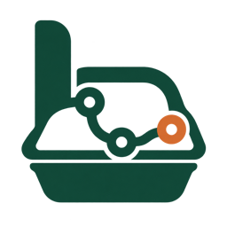
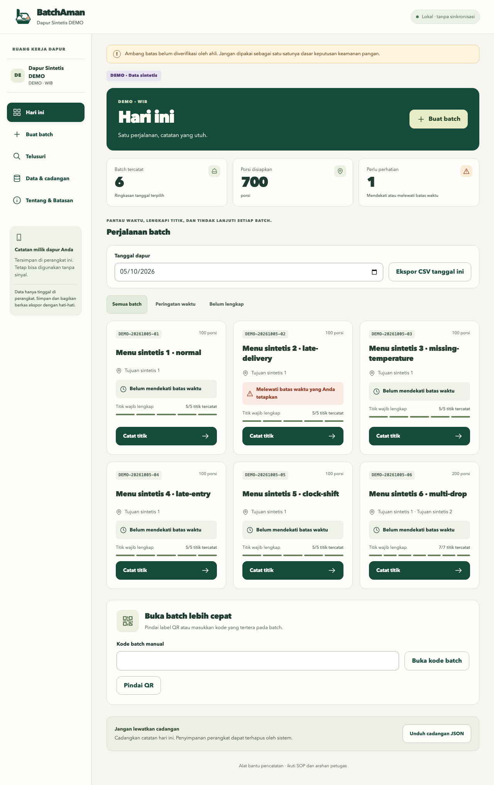
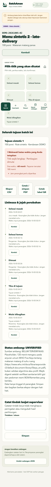

# BatchAman



> **Ambang batas belum diverifikasi oleh ahli. Jangan dipakai sebagai satu-satunya dasar keputusan keamanan pangan.**
>
> Aplikasi bukan pengganti SOP resmi, SLHS, atau pengawasan petugas. Ini alat bantu dapur gratis, bukan produk untuk kontrak pemerintah sebelum validasi lapangan. Tidak pernah memberi status makanan “aman” atau “tidak aman”.

PWA open source berbahasa Indonesia untuk mencatat perjalanan satu batch makanan dari selesai masak sampai mulai dibagikan. Semua data tinggal di perangkat; semua data contoh sintetis. Tidak ada akun, backend, sinkronisasi, GPS, foto orang, AI, telemetri, atau notifikasi ketika aplikasi tertutup.



<details><summary>Tampilan ponsel</summary>



</details>

## Menjalankan

Node.js 22.19+ dan pnpm 10.18.3 diperlukan. Gunakan lockfile yang disertakan.

```sh
corepack enable
pnpm install --frozen-lockfile
pnpm dev
```

Buka alamat localhost yang dicetak Vite. Mode offline service worker tersedia pada **build produksi**, bukan server development:

```sh
pnpm build
pnpm --filter @batchaman/web preview --host 127.0.0.1
```

Pada mesin pengembangan ini, jika pnpm tidak ada di PATH: `corepack enable --install-directory node_modules/.bin`, lalu gunakan `COREPACK_HOME="$PWD/.corepack" corepack pnpm check`.

## Pemakaian

1. Isi profil dapur dan WIB/WITA/WIT. Gunakan kode dapur singkat, bukan identitas pribadi.
2. Buat batch dan satu atau beberapa tujuan; total porsi tujuan harus sama dengan porsi batch.
3. Cetak label QR (A6 atau strip 58 mm). QR hanya memuat kode, dan hanya membuka data yang sudah ada di perangkat.
4. Pilih batch, pilih titik, konfirmasi. Suhu opsional; jangan menebak. Titik tiba dan mulai dibagikan berlaku per tujuan.
5. Gunakan Urungkan selama 10 detik untuk entri biasa; setelah itu gunakan Koreksi dengan alasan. Log lama tidak dihapus.
6. Periksa status waktu, kelengkapan, dan flag kualitas secara terpisah. Ikuti SOP dan arahan petugas untuk tindakan.
7. Unduh cadangan JSON setiap hari. Telusuri kode/tanggal/tujuan, ekspor CSV atau cetak/simpan PDF untuk ringkasan.

CSV harian memuat ringkasan per tujuan dan seluruh linimasa termasuk koreksi/pembatalan. CSV metrik memuat durasi entri dan jeda input. Ekspor bukan berkas terenkripsi: simpan dan bagikan dengan hati-hati. Pemulihan JSON **mengganti** data lokal, bukan menggabungkan dua perangkat.

## Pasang di Android dan iOS

- Android/Chrome: buka URL HTTPS, tunggu pemuatan awal selesai, menu browser → **Tambahkan ke layar utama / Instal aplikasi**. Buka sekali dengan jaringan, lalu coba mode pesawat dan muat ulang sebelum dibawa ke lapangan.
- Izinkan penyimpanan persisten saat tersedia (Data & cadangan). Persetujuan browser tidak menjamin data tidak hilang.
- iPhone/iPad/Safari: Bagikan → **Tambahkan ke Layar Utama**. Penyimpanan bisa dibersihkan sistem. Simpan cadangan di luar aplikasi setiap hari; jangan menganggap ikon aplikasi sebagai cadangan.
- Kamera memerlukan izin dan HTTPS. Jika BarcodeDetector tidak tersedia, scanner lokal menjadi cadangan; kode manual selalu tersedia. Getar/audio bergantung perangkat dan izin browser.
- Pilih ukuran kertas yang sama pada dialog printer; uji pemindaian label fisik sebelum pilot. `Cetak / simpan PDF` memakai dialog cetak browser.

## Ambang dan batasan

Nilai 60°C, 5°C, 120 menit, 0,75, dan toleransi 10 menit adalah **placeholder UNVERIFIED**. Penerapan rujukan WHO maupun pedoman BGN/Kemenkes: **BELUM TERVERIFIKASI**. [Prosedur verifikasi](docs/THRESHOLDS.md) wajib dilakukan bersama sanitarian/ahli gizi. Impor JSON VERIFIED memerlukan `verifiedBy` dan `verifiedAt`, tetapi aplikasi tidak dapat membuktikan keahlian pemeriksa.

Baca [batasan](docs/LIMITATIONS.md), [aturan domain](docs/DOMAIN.md), [arsitektur](docs/ARCHITECTURE.md), [pertanyaan terbuka](docs/OPEN_QUESTIONS.md), dan [kit pilot](docs/FIELD_TEST.md). Minimisasi data pribadi dimaksudkan selaras dengan semangat UU PDP No.27/2022 (**BELUM TERVERIFIKASI**, bukan klaim kepatuhan); konsultasikan penggunaan produksi dengan ahli hukum.

## Pengujian

```sh
pnpm check
pnpm coverage
pnpm exec playwright install chromium
pnpm e2e
pnpm budget
pnpm audit --audit-level high
pnpm licenses list --prod --json > licenses.json
node scripts/check-licenses.mjs licenses.json
```

[QUALITY.md](docs/QUALITY.md) memisahkan hasil terukur dari pemeriksaan tertunda. [ACCEPTANCE.md](docs/ACCEPTANCE.md) memetakan AC-01–15 ke nama tes; [PROGRESS.md](docs/PROGRESS.md) menyimpan status tiap fase. Lighthouse CI menyimpan laporan sebagai artifact. Tidak ada klaim hasil pilot atau validasi keamanan pangan.

## Demo GitHub Pages

[**Buka DEMO sintetis**](https://sellebeww.github.io/batchaman/) · [Source GitHub](https://github.com/sellebeww/batchaman)

Workflow `.github/workflows/pages.yml` membangun mode DEMO dengan penyimpanan terpisah dan data sintetis awal. Pengelola mengaktifkan Pages → GitHub Actions, lalu push main; deployment berjalan setelah CI sukses. Status URL aktual dicatat di [DEPLOYMENT.md](docs/DEPLOYMENT.md); keberadaan workflow saja tidak berarti sudah terdeploy.

## English summary

BatchAman is an Indonesian, offline-first food-batch recordkeeping PWA. It tracks timestamps and optional temperatures across kitchen, transport and multiple destinations. Default thresholds are **unverified placeholders**; the app makes no food-safety determination and does not replace official procedures or professional supervision. Data stays on the device, with local CSV/JSON export, a tamper-evident (not tamper-proof) hash chain, and no backend or telemetry. Field validation is required before production claims or government contracting.

Apache-2.0. Lihat [CONTRIBUTING.md](CONTRIBUTING.md) dan [SECURITY.md](SECURITY.md).

Pembaruan tampilan dan identitas: [UI_REFRESH.md](docs/UI_REFRESH.md). Temuan keamanan, perbaikan, dan risiko tersisa: [SECURITY_REVIEW.md](docs/SECURITY_REVIEW.md).
